# Agenz OS — AI-First Diagnostic CRM + Execution Control Tower (Multi-Tenant)
## Software Development & Management (SDM) Proposal

**Document Version:** 3.1
**Date:** 22 February 2026
**Prepared by:** Agenz MY
**Website:** agenz.my
**Classification:** Internal + Competition Submission

---

## Changelog

| Version | Date | Changes |
|---|---|---|
| 3.1 | 22 Feb 2026 | Added role-based access (Admin vs Client views), Admin "View As Client" impersonation, CRM drag-and-drop pipeline, Customer Contact Panel boilerplate (WhatsApp/Email/Call) |
| 3.0 | 20 Feb 2026 | Full frontend build: 17 pages, mock data, dark/light mode, all core modules |

---

## Table of Contents

1. [Project Proposal](#10-project-proposal)
2. [Functional Requirements](#20-functional-requirements)
3. [Non-Functional Requirements](#30-non-functional-requirements)
4. [Proposed Tech Stack](#40-proposed-tech-stack-cost-aware)
5. [System Diagrams](#50-system-diagrams)
6. [Risks & Mitigations](#60-risks--mitigations)
7. [Testing Plan](#70-testing-plan)
8. [Implementation Plan](#80-implementation-plan)
9. [Acceptance Criteria](#90-acceptance-criteria)
10. [Appendix](#100-appendix)
11. [Frontend Implementation Notes](#110-frontend-implementation-notes)

---

## 1.0 Project Proposal

### 1.1 Project Title

**Agenz OS — AI-First Diagnostic CRM + Execution Control Tower (Multi-Tenant)**

---

### 1.2 Background & Problem Statement

Agenz is a digital marketing and growth agency operating at agenz.my. As the agency scales its client portfolio, it faces a systemic problem shared by most agencies today: existing CRMs track data but fail to diagnose the real constraints holding a business back.

The agency currently relies on GoHighLevel (GHL) for CRM and automation workflows. However, GHL presents the following limitations that directly impact Agenz's ability to deliver, retain, and grow client accounts:

| Problem | Impact |
|---|---|
| CRMs track data but don't diagnose constraints | No clarity on what is actually breaking a client's growth |
| No automatic KPI calculation from pipeline activity | Manual number-crunching; delay in spotting problems |
| Agency delivery feels opaque to clients | Low trust, high churn risk, reduced retention |
| Reporting is manual, inconsistent, and not tied to financial impact | No proof of ROI, hard to justify retainers |
| Upgrades, payments, and contracts are fragmented across multiple tools | Operational inefficiency, missed revenue, slow onboarding |
| No unified internal OS for agency finance, project tracking, and client health | Poor visibility into Agenz's own performance and profitability |
| Lead acquisition via Facebook and WhatsApp is disconnected from CRM | Leads fall through the cracks; no centralised conversation thread |
| No client-side finance visibility | Clients cannot track their own P&L within the same system |

Agenz OS is proposed as the solution: a purpose-built, AI-first, multi-tenant web application that replaces key GHL workflows and becomes a unified client acquisition, delivery, and reporting control tower — for both Agenz's clients and for Agenz itself.

---

### 1.3 Objectives

1. **Onboarding-First Lead Magnet** — Users begin with an AI onboarding questionnaire (no account required). The questionnaire captures business profile, pipeline stages, conversion data, and unit economics. The AI generates a pipeline blueprint and constraint report. The account is created at completion — making the diagnostic engine the lead magnet.

2. **Full Diagnostic CRM** — After onboarding, clients access a live CRM with Facebook Lead Ads integration, WhatsApp communication, Stripe account integration (for tracking client sales), calendar + appointment booking, Google Calendar sync, bulk lead upload, pipeline management, tags, colour-coding, and sub-user management. The CRM automatically tracks real conversion rates, CPL, and CAC — and continuously compares them against the onboarding baseline.

3. **Client Finance Dashboard** — Each client tenant has a finance section where monthly revenue, expenses, and profit are auto-computed from connected sources and can also be manually adjusted each month for accuracy.

4. **Admin-Controlled Subscription Upgrade** — Subscription is not self-serve. Agenz admins review the client's profile, select the appropriate package, generate a proposal and quotation, send a contract, confirm payment, and flip the upgrade. The system automatically unlocks the feature set.

5. **Execution Roadmap + KPI Delta Reporting** — After upgrade, the system auto-generates a Gantt-style execution roadmap and activates before/after KPI delta dashboards showing the financial impact of Agenz's services in RM.

6. **Repeating Improvement Cycle** — Once a constraint is resolved, the system identifies the next bottleneck and surfaces the relevant Agenz upsell service. The cycle repeats: diagnose → execute → report → recommend → upsell.

7. **Agenz Internal OS** — The same platform powers Agenz's own operations: internal CRM, finance dashboard (income, expenses, profit per client, income statements), portfolio Gantt, and an AI advisory layer monitoring client health and surfacing at-risk signals.

---

### 1.4 Scope

#### In Scope (MVP → V1)

- Multi-tenant architecture: one company account (Tenant) → multiple sub-users per tenant
- **Three roles only:** Free Client / Paid Client / Admin
- Admin has full access to all tenant CRMs, data, pipelines, and KPIs
- **Onboarding-first account creation** — collects business name, location, website, social media links, email and password during the AI questionnaire; account created on completion
- **Auth:** Login, forgot password (OTP via email), password reset
- AI-driven business classification and pipeline blueprint generation
- **Live CRM** with pipeline stages, lead management, colour-coding, tags, notes, activity logs
- **Facebook Lead Ads integration** — leads auto-imported via Meta webhook
- **WhatsApp Business integration** — in-CRM messaging thread per contact
- **Stripe account integration** — clients connect their Stripe account to auto-track sales revenue
- **Calendar + appointment booking** — client contacts can book appointments; Google Calendar sync
- **Bulk lead upload** — CSV/Excel import with field mapping
- **Sub-user management** — each tenant can create and manage multiple sub-users; owner controls per-user access permissions
- **Multiple pipelines** per tenant — each pipeline configurable with custom stages
- **Client finance dashboard** — auto-computed monthly P&L from connected data + manual monthly entry override
- Automatic KPI tracking from CRM data (conversion rate per stage, CPL, CAC, LTV)
- Constraint engine running on live CRM data
- Admin-gated subscription — no self-serve; admin selects package, generates proposal, sends contract, confirms payment, flips upgrade
- Proposal and quotation PDF generation
- Contract signing flow + payment verification gate (Stripe + manual fallback)
- Execution roadmap (Gantt) with phases, tasks, expected KPI improvements
- KPI delta engine (before vs. after in RM)
- Automated monthly reports (PDF + email)
- Repeating constraint-to-upsell recommendation cycle
- **Settings page:** company info, sub-user management, pipeline configuration, KPI overrides, integrations (Facebook, WhatsApp, Stripe, Google Calendar), billing history
- **Agenz Internal OS:** internal CRM, finance dashboard, income statements, portfolio Gantt, client risk scores, AI advisory layer

#### Out of Scope (Future Phases)

- Full ad platform campaign management (Meta / Google / TikTok campaign creation)
- AI voice caller engine
- Full influencer marketplace tooling
- Native mobile application (mobile wrapper via appmyweb or Capacitor post-V1)
- Instagram Direct Message inbox
- Custom domain white-labelling per tenant

---

### 1.5 Assumptions

1. The first release targets the web application. Mobile delivery will be handled via a wrapper post-V1.
2. Facebook Lead Ads integration uses Meta Webhook. CSV upload serves as fallback.
3. WhatsApp integration uses WhatsApp Business API via Meta (or Twilio fallback).
4. Stripe integration allows clients to connect their own Stripe account via OAuth to import transaction/revenue data.
5. Google Calendar integration uses OAuth 2.0 — appointments created in Agenz OS sync to connected Google Calendars.
6. Subscription upgrades are exclusively admin-initiated. Clients cannot self-subscribe.
7. AI operates as an advisory and generation layer. It does not autonomously modify financial data, billing, or contracts without admin confirmation.
8. Client finance dashboard figures are auto-computed where possible and can be manually adjusted monthly.
9. Sub-users inherit the parent tenant's subscription tier. Access permissions within the tenant are controlled by the tenant owner.

---

### 1.6 Key Deliverables

| Deliverable | Description |
|---|---|
| Web Application | Next.js + TypeScript full-stack web app, deployed on Vercel |
| AI Onboarding Engine | Multi-step questionnaire that collects full business profile + creates account + generates pipeline blueprint + constraint report |
| Diagnostic CRM | Live pipeline CRM with Facebook, WhatsApp, Stripe, Calendar, bulk upload, auto KPI tracking, sub-users, multi-pipeline, and constraint alerts |
| Client Finance Dashboard | Monthly P&L auto-computed from connected data with manual override option |
| Settings Module | Sub-user management, company info, pipeline config, integrations, KPI settings |
| Admin Panel | All-tenant CRM access, upgrade management, package configuration, portfolio health view |
| Sales Automation Module | Proposal/quotation PDF generation, contract signing, payment verification, execution unlock |
| Execution Control Tower | Gantt roadmap, KPI delta engine, before/after dashboard, monthly auto reports |
| Agenz Internal OS | Internal CRM, finance dashboard, income statements, portfolio Gantt, AI advisory layer |
| SDM Documentation | Full proposal, diagrams (Gantt, Flowchart, Use Case, UML, DFD), test plan |

---

## 2.0 Functional Requirements

### 2.1 User & Account Management

| ID | Requirement |
|---|---|
| FR-1 | System shall support three roles only: Free Client, Paid Client, and Admin |
| FR-2 | System shall allow creation of a Tenant (company account) with a unique workspace during onboarding |
| FR-3 | System shall allow the Tenant owner to create and manage sub-users within their workspace |
| FR-4 | Tenant owner shall control sub-user permissions: which pipelines, contacts, and modules each sub-user can access |
| FR-5 | System shall enforce role-based access controls per feature and module for all three roles |
| FR-6 | Admin shall have full read and write access to all tenant CRMs, pipelines, KPI data, and finance records |
| FR-7 | Subscription upgrades shall only be triggered by Admin. Clients cannot self-subscribe or self-upgrade |
| FR-8 | System shall support password reset via OTP sent to registered email address |

---

### 2.2 AI Onboarding & Business Profiling (Account Creation Flow)

| ID | Requirement |
|---|---|
| FR-9 | System shall begin onboarding without requiring a pre-existing account |
| FR-10 | Step 1 shall collect: Business name, business location, website URL, social media profile links (Instagram, Facebook, TikTok, LinkedIn, etc.) |
| FR-11 | Step 2 shall collect: Business model (B2B/B2C), business category (Service / Ecommerce / Software / Education), checkout type (Salesman In-Person / Salesman Online / Self-Checkout In-Person / Self-Checkout Online), lead sources (Warm Outreach / Cold Outreach / Organic Content / Paid Ads) |
| FR-12 | Step 3 shall collect: Pipeline setup — stage names, expected conversion rate per stage, average deal value, sales cycle length, and intended number of sub-users |
| FR-13 | Step 4 shall collect: Unit economics — monthly revenue, COGS, CAC, LTV, churn rate, cost per lead, and per-product breakdown |
| FR-14 | Step 5 shall collect: Account credentials — business email and password (account creation) |
| FR-15 | System shall use AI (GPT-4o) to generate a pipeline blueprint with recommended stages and KPI targets tailored to the business model |
| FR-16 | System shall generate a Constraint Report on onboarding completion: top bottleneck(s), RM leakage estimate, improvement recommendations |
| FR-17 | System shall create the Tenant, first User (owner), and default pipeline automatically on onboarding completion and log the user in |

---

### 2.3 CRM — Lead & Contact Management

| ID | Requirement |
|---|---|
| FR-18 | System shall provide a full CRM with Contacts, Leads, Deals, pipeline stages, notes, activity logs, and file attachments per tenant |
| FR-19 | System shall integrate with Facebook Lead Ads via Meta Webhook — new form submissions auto-create a Lead record |
| FR-20 | System shall provide an in-CRM WhatsApp conversation thread per contact via WhatsApp Business API |
| FR-21 | System shall support bulk lead upload via CSV or Excel with field mapping UI |
| FR-22 | System shall allow users to assign colour codes and tags to Contacts and Deals |
| FR-23 | System shall allow deals to be moved between pipeline stages via drag-and-drop |
| FR-24 | System shall maintain a full activity log per Contact: calls, messages, notes, stage changes, appointments, and file attachments |
| FR-25 | System shall support multiple pipelines per tenant — each with configurable stages, colours, and expected conversion rates |
| FR-26 | Each pipeline shall be assignable to specific sub-users and accessible only by permitted sub-users |

---

### 2.4 Stripe Integration (Client Sales Tracking)

| ID | Requirement |
|---|---|
| FR-27 | System shall allow clients to connect their own Stripe account via Stripe OAuth |
| FR-28 | System shall import Stripe payment records to auto-populate the client finance dashboard |
| FR-29 | System shall display Stripe revenue alongside manually entered finance data in the monthly P&L view |
| FR-30 | Stripe integration shall be available to Ecommerce, Software, and Agency business types |

---

### 2.5 Calendar & Appointment Booking

| ID | Requirement |
|---|---|
| FR-31 | System shall provide a calendar module where client contacts can book appointments |
| FR-32 | System shall allow users to define availability slots, appointment types, and booking durations |
| FR-33 | System shall provide a shareable booking link per user/sub-user |
| FR-34 | System shall integrate with Google Calendar via OAuth 2.0 — appointments created in Agenz OS sync to Google Calendar and vice versa |
| FR-35 | Booked appointments shall create an Activity entry in the associated Contact record |

---

### 2.6 Sub-User Management

| ID | Requirement |
|---|---|
| FR-36 | Tenant owner shall be able to create sub-user accounts under their tenant workspace |
| FR-37 | Each sub-user shall have their own login credentials and personal dashboard |
| FR-38 | Tenant owner shall assign each sub-user access permissions: which pipelines, contact lists, calendar slots, and modules they can view or edit |
| FR-39 | Sub-users shall inherit the parent tenant's subscription tier (e.g., if tenant is Paid, all sub-users have access to Paid features) |
| FR-40 | System shall display a sub-user list in the Settings page where owner can add, edit, or remove sub-users |

---

### 2.7 Automatic KPI Tracking & Constraint Engine

| ID | Requirement |
|---|---|
| FR-41 | System shall automatically compute real-time KPIs from CRM pipeline data: conversion rate per stage, CPL, CAC, LTV, and churn rate |
| FR-42 | System shall compare computed CRM KPIs against the onboarding baseline and highlight the delta |
| FR-43 | System shall run a live Constraint Engine identifying which pipeline stage has the lowest conversion rate and estimating the revenue leakage in RM |
| FR-44 | System shall display a "Potential Improvement" card showing additional revenue if the constraint is resolved and which Agenz service addresses it |
| FR-45 | Users shall be able to manually override any KPI value in Settings — the system will use the manual value until the next auto-compute cycle |
| FR-46 | System shall surface a new constraint alert each time an existing bottleneck is resolved |

---

### 2.8 Client Finance Dashboard

| ID | Requirement |
|---|---|
| FR-47 | System shall provide each client tenant with a Finance Dashboard showing monthly P&L (revenue, COGS, expenses, gross profit, net profit) |
| FR-48 | Finance figures shall be auto-populated from connected data sources: Stripe transactions, pipeline won deals |
| FR-49 | Users shall be able to manually enter or adjust any monthly finance figure to correct for data not captured by integrations |
| FR-50 | System shall display month-over-month trends and flag significant changes in profit margins |
| FR-51 | Finance data shall feed into the Constraint Engine and KPI delta calculations |

---

### 2.9 Settings

| ID | Requirement |
|---|---|
| FR-52 | Settings shall include: Company Profile (name, location, logo, website, social links), Sub-User Management, Pipeline Configuration, KPI Overrides, Connected Integrations (Facebook, WhatsApp, Stripe, Google Calendar), and Billing History |
| FR-53 | Users shall be able to update their business information, pipeline stages, and expected KPI targets in Settings at any time |
| FR-54 | System shall log any manual changes to KPIs or finance figures with a timestamp and user ID |

---

### 2.10 Admin-Controlled Package Upgrade System

| ID | Requirement |
|---|---|
| FR-55 | Admin shall be able to view all client tenants, their onboarding profile, live KPIs, CRM health, and finance summary |
| FR-56 | Admin shall select a package for a client tenant and initiate the upgrade flow |
| FR-57 | Package configuration shall define which modules are enabled and what usage limits apply per tier |
| FR-58 | An admin-confirmed upgrade (contract signed + payment verified) shall immediately activate the execution layer |

---

### 2.11 Proposal / Quotation / Contract / Payment

| ID | Requirement |
|---|---|
| FR-59 | System shall auto-generate a proposal PDF from the selected package and custom add-ons, including Agenz branding, line items, terms, and pricing |
| FR-60 | System shall generate a quotation with itemised line items, pricing in RM, and validity period |
| FR-61 | System shall support a contract signing flow — tracked PDF acceptance (MVP), upgradeable to DocuSign |
| FR-62 | System shall verify payment via Stripe webhook or manual receipt upload |
| FR-63 | Execution layer shall only be unlocked once both contract signing AND payment verification are confirmed |
| FR-64 | System shall maintain an immutable audit trail for all proposal, contract, and payment state changes |

---

### 2.12 Execution Control Tower (Paid Tier)

| ID | Requirement |
|---|---|
| FR-65 | System shall display a Gantt execution roadmap with phases, tasks, owners, and expected KPI improvements — auto-generated on upgrade |
| FR-66 | System shall support manual KPI entry + automatic KPI sync from CRM pipeline and Stripe data |
| FR-67 | System shall compute and display KPI deltas (before vs. after Agenz engagement) in RM |
| FR-68 | System shall display a "Money Unlocked" metric showing the cumulative RM delta since engagement began |
| FR-69 | System shall auto-generate and deliver a monthly report (AI-summarised PDF) on a scheduled basis |
| FR-70 | System shall surface the next constraint and recommended Agenz service at the end of each reporting cycle |

---

### 2.13 Agenz Internal OS (Admin Only)

| ID | Requirement |
|---|---|
| FR-71 | System shall provide Agenz admins with an internal CRM tracking all active client accounts, deal statuses, and relationship history |
| FR-72 | System shall provide a finance dashboard: income per client, expenses, profit, and agency-level income statement |
| FR-73 | System shall display an agency-wide portfolio Gantt across all active client roadmaps |
| FR-74 | System shall compute a client health/risk score based on KPI trends, engagement level, and contract stage |
| FR-75 | System shall provide an AI advisory layer surfacing at-risk clients, upsell opportunities, and resource strain signals |
| FR-76 | AI advisory layer shall generate recommended next actions for each flagged client |

---

## 3.0 Non-Functional Requirements

| Category | Requirement |
|---|---|
| **Cost Efficiency** | Storage offloaded to Supabase Storage / Cloudflare R2. DB connections use pooling. AI calls cached where appropriate |
| **Performance** | Dashboard reads are cached. DB connections use connection pooling for serverless compatibility. Heavy jobs run in background workers |
| **Security** | Strict tenant isolation via `tenantId` scoping on all queries. Admin access to tenant data is permissioned and logged. RBAC enforced server-side. Sub-user permissions enforced on every request |
| **Scalability** | Serverless-friendly pooling. Background jobs separated from API handlers. Package config is data-driven |
| **Observability** | Error tracking enabled. Log retention capped. Noisy logs suppressed in production |
| **Availability** | Target 99.5% uptime for MVP. Graceful degradation for AI provider outages (cached reports served) |
| **Data Integrity** | KPI deltas derived from real DB records. AI generates narrative and recommendations only — never overwrites financial metrics |
| **Compliance** | WhatsApp opt-in consent captured at lead intake. PDPA-compliant data handling. Stripe OAuth follows PCI-DSS scope offloading |

---

## 4.0 Proposed Tech Stack (Cost-Aware)

| Layer | Technology | Rationale |
|---|---|---|
| **Frontend/Web** | Next.js 15 (App Router) + TypeScript | SSR + API routes in one framework. Vercel-native |
| **UI Library** | shadcn/ui + Tailwind CSS + Lucide Icons | Production-ready, clean design system |
| **Database** | Supabase Postgres + Prisma ORM | Relational model fits multi-tenant. Pooled connections. Supabase provides Auth + Storage |
| **Auth** | Supabase Auth (SSR) | Built-in session management, OTP email, RLS, role support |
| **File Storage** | Supabase Storage (or Cloudflare R2) | Low egress cost for PDFs, reports, lead attachments |
| **CRM Integrations** | Meta Webhooks (Facebook Leads), WhatsApp Business API | Webhooks for Lead Ads. WhatsApp API for in-CRM messaging |
| **Stripe** | Stripe API + Stripe OAuth + Webhooks | Client sales tracking via connected Stripe accounts. Payment verification |
| **Calendar** | Google Calendar API (OAuth 2.0) | Appointment sync. Standard, widely adopted |
| **Payments** | Stripe (subscriptions + invoices) | Admin-confirmed upgrades trigger via Stripe webhooks |
| **E-Signature** | Tracked PDF acceptance (MVP) → DocuSign / Dropbox Sign | Start simple. Upgrade path defined |
| **AI** | OpenAI API (GPT-4o) + controlled prompt layer | Onboarding, constraint analysis, report summarisation, internal OS advisory |
| **Background Jobs** | Vercel Cron / QStash (Upstash) | Monthly report scheduler |
| **Cache** | Upstash Redis (optional) | Dashboard caching + rate limiting per tenant |
| **Deployment** | Vercel | Zero-config deployment. Scales automatically |

---

## 5.0 System Diagrams

### 5.1 System Flowchart — Full User Journey


---

### 5.2 Use Case Diagram


---

### 5.4 UML Class Diagram

```plantuml
@startuml
skinparam classAttributeIconSize 0

class Tenant {
  +id: UUID
  +name: string
  +businessCategory: string
  +businessModel: string
  +location: string
  +websiteUrl: string
  +socialLinks: json
  +logoUrl: string
  +createdAt: datetime
}

class User {
  +id: UUID
  +tenantId: UUID
  +role: Role
  +email: string
  +hashedPassword: string
  +name: string
  +avatarUrl: string
  +isOwner: boolean
  +permissions: json
  +createdAt: datetime
}

enum Role {
  FREE_CLIENT
  PAID_CLIENT
  ADMIN
}

class Subscription {
  +id: UUID
  +tenantId: UUID
  +packageId: UUID
  +status: SubscriptionStatus
  +startDate: datetime
  +endDate: datetime
  +activatedByAdminId: UUID
  +contractId: UUID
  +paymentId: UUID
}

enum SubscriptionStatus {
  PENDING
  ACTIVE
  SUSPENDED
  CANCELLED
}

class Package {
  +id: UUID
  +name: string
  +tier: PackageTier
  +modules: json
  +limits: json
  +priceRM: float
}

enum PackageTier {
  STARTER
  BEGINNER
  INTERMEDIATE
  ADVANCED
  AI_CHATBOT
  AI_CALLER
  WEBSITE
  AUTOMATION
  CUSTOM
}

class OnboardingProfile {
  +id: UUID
  +tenantId: UUID
  +businessModel: string
  +businessCategory: string
  +checkoutType: string
  +leadSources: json
  +intendedSubUsers: int
  +pipelineStages: json
  +unitEconomics: json
  +automationScore: float
  +completedAt: datetime
}

class Contact {
  +id: UUID
  +tenantId: UUID
  +assignedUserId: UUID
  +name: string
  +email: string
  +phone: string
  +source: LeadSource
  +colourTag: string
  +tags: string[]
  +notes: string
  +createdAt: datetime
}

enum LeadSource {
  FACEBOOK_ADS
  WHATSAPP
  BULK_UPLOAD
  MANUAL
  ORGANIC
  STRIPE
  REFERRAL
}

class Deal {
  +id: UUID
  +tenantId: UUID
  +contactId: UUID
  +pipelineId: UUID
  +stageId: UUID
  +value: float
  +status: DealStatus
  +assignedUserId: UUID
  +movedAt: datetime
  +closedAt: datetime
}

enum DealStatus {
  OPEN
  WON
  LOST
}

class Activity {
  +id: UUID
  +contactId: UUID
  +tenantId: UUID
  +type: ActivityType
  +notes: string
  +createdAt: datetime
  +createdByUserId: UUID
}

enum ActivityType {
  NOTE
  CALL
  EMAIL
  WHATSAPP_MESSAGE
  STAGE_CHANGE
  APPOINTMENT
  FILE_UPLOAD
}

class Message {
  +id: UUID
  +tenantId: UUID
  +contactId: UUID
  +channel: string
  +direction: MessageDirection
  +content: string
  +sentAt: datetime
  +status: string
}

enum MessageDirection {
  INBOUND
  OUTBOUND
}

class Appointment {
  +id: UUID
  +tenantId: UUID
  +contactId: UUID
  +hostUserId: UUID
  +title: string
  +scheduledAt: datetime
  +durationMins: int
  +googleCalendarEventId: string
  +status: AppointmentStatus
}

enum AppointmentStatus {
  SCHEDULED
  COMPLETED
  CANCELLED
  NO_SHOW
}

class Integration {
  +id: UUID
  +tenantId: UUID
  +type: IntegrationType
  +credentials: json
  +isActive: boolean
  +lastSyncAt: datetime
}

enum IntegrationType {
  FACEBOOK_LEAD_ADS
  WHATSAPP_BUSINESS
  STRIPE_CONNECT
  GOOGLE_CALENDAR
}

class Pipeline {
  +id: UUID
  +tenantId: UUID
  +name: string
  +generatedByAI: boolean
  +assignedUserIds: UUID[]
}

class Stage {
  +id: UUID
  +pipelineId: UUID
  +name: string
  +order: int
  +colourHex: string
  +expectedConversionPct: float
  +actualConversionPct: float
}

class KPIRecord {
  +id: UUID
  +tenantId: UUID
  +date: date
  +cpl: float
  +cac: float
  +ltv: float
  +churnRate: float
  +conversionRates: json
  +source: KPISource
  +overriddenByUserId: UUID
}

enum KPISource {
  AUTO_CRM
  MANUAL_ENTRY
  STRIPE_IMPORT
}

class ClientFinanceRecord {
  +id: UUID
  +tenantId: UUID
  +month: string
  +revenueRM: float
  +cogsRM: float
  +expensesRM: float
  +grossProfitRM: float
  +netProfitRM: float
  +revenueSource: string
  +isManualOverride: boolean
  +updatedByUserId: UUID
  +updatedAt: datetime
}

class ConstraintReport {
  +id: UUID
  +tenantId: UUID
  +generatedAt: datetime
  +baselineSnapshot: json
  +liveSnapshot: json
  +constraints: json
  +recommendations: json
  +lostRevenueEstimateRM: float
  +potentialUpsideRM: float
  +cacLtvRatio: float
  +automationLevel: string
  +suggestedAgenzService: string
}

class Proposal {
  +id: UUID
  +tenantId: UUID
  +packageId: UUID
  +lineItems: json
  +totalAmountRM: float
  +currency: string
  +pdfUrl: string
  +status: ProposalStatus
  +createdByAdminId: UUID
  +createdAt: datetime
}

enum ProposalStatus {
  DRAFT
  SENT
  ACCEPTED
  REJECTED
}

class Contract {
  +id: UUID
  +tenantId: UUID
  +proposalId: UUID
  +signedUrl: string
  +signedAt: datetime
  +status: ContractStatus
}

enum ContractStatus {
  PENDING
  SIGNED
  VOIDED
}

class Payment {
  +id: UUID
  +tenantId: UUID
  +provider: string
  +invoiceId: string
  +status: PaymentStatus
  +amountRM: float
  +paidAt: datetime
  +receiptUrl: string
  +verifiedByAdminId: UUID
}

enum PaymentStatus {
  PENDING
  PAID
  FAILED
  REFUNDED
}

class Roadmap {
  +id: UUID
  +tenantId: UUID
  +phases: json
  +generatedAt: datetime
  +lastUpdatedAt: datetime
}

class MonthlyReport {
  +id: UUID
  +tenantId: UUID
  +month: string
  +kpiDelta: json
  +revenueImpactRM: float
  +moneyUnlockedRM: float
  +recommendations: json
  +nextConstraint: string
  +pdfUrl: string
  +sentAt: datetime
}

class AgenzFinanceRecord {
  +id: UUID
  +month: string
  +clientTenantId: UUID
  +incomeRM: float
  +expensesRM: float
  +profitRM: float
  +marginPct: float
}

class IndustryBenchmark {
  +id: UUID
  +industry: string
  +geography: string
  +cplMin: float
  +cplMax: float
  +cacMin: float
  +cacMax: float
  +closeRateMin: float
  +closeRateMax: float
  +roasMin: float
  +roasMax: float
  +aovDependent: boolean
  +lastUpdated: date
  +source: string
}

class BenchmarkStatus {
  +id: UUID
  +tenantId: UUID
  +industry: string
  +cplStatus: BenchmarkPosition
  +cacStatus: BenchmarkPosition
  +closeRateStatus: BenchmarkPosition
  +roasStatus: BenchmarkPosition
  +primaryGap: string
  +checkedAt: datetime
}

enum BenchmarkPosition {
  BELOW_MARKET
  WITHIN_MARKET
  ABOVE_MARKET
}

class BaselineSnapshot {
  +id: UUID
  +tenantId: UUID
  +version: int
  +capturedAt: datetime
  +periodStart: date
  +periodEnd: date
  +avgRevenueRM: float
  +avgProfitRM: float
  +avgCAC: float
  +avgLTV: float
  +avgConversionRate: float
  +avgChurnRate: float
  +avgCPL: float
  +isImmutable: boolean
  +verificationStatus: string
  +createdByAdminId: UUID
}

class Notification {
  +id: UUID
  +tenantId: UUID
  +type: NotificationType
  +title: string
  +body: string
  +channel: NotificationChannel
  +isRead: boolean
  +sentAt: datetime
  +cooldownDays: int
  +serviceRecommendation: string
  +constraintImpactPct: float
  +projectedUpsideRM: float
}

enum NotificationType {
  SYSTEM_ALERT
  TRANSACTIONAL
  PROMOTIONAL
}

enum NotificationChannel {
  IN_APP_MODAL
  IN_APP_BANNER
  EMAIL
}

class LeaderboardEntry {
  +id: UUID
  +tenantId: UUID
  +baselineRevenue: float
  +currentRevenue: float
  +growthPercentage: float
  +rank: int
  +eligibleStatus: boolean
  +lastUpdated: datetime
  +isAnonymised: boolean
}

class CompetitionEligibility {
  +id: UUID
  +tenantId: UUID
  +crmUsageDays: int
  +crmUsageThresholdMet: boolean
  +courseCompletionPct: float
  +courseCompletionMet: boolean
  +subscriptionActive: boolean
  +baselineLocked: boolean
  +revenueDoubled: boolean
  +refundStatus: RefundStatus
  +creditStatus: CreditStatus
  +fraudFlagged: boolean
  +checkedAt: datetime
}

enum RefundStatus {
  NOT_APPLICABLE
  ELIGIBLE
  CLAIMED
  CONVERTED_TO_CREDIT
  REJECTED
}

enum CreditStatus {
  NOT_APPLICABLE
  ACTIVE
  EXHAUSTED
}

class Course {
  +id: UUID
  +title: string
  +modules: json
  +totalLessons: int
  +publishedAt: datetime
}

class CourseCompletion {
  +id: UUID
  +tenantId: UUID
  +userId: UUID
  +courseId: UUID
  +completionPct: float
  +lessonsCompleted: int
  +completedAt: datetime
}

Tenant "1" -- "many" User
Tenant "1" -- "0..1" Subscription
Subscription "many" -- "1" Package
Tenant "1" -- "0..1" OnboardingProfile
Tenant "1" -- "many" Contact
Contact "1" -- "many" Deal
Contact "1" -- "many" Activity
Contact "1" -- "many" Message
Contact "1" -- "many" Appointment
Tenant "1" -- "many" Integration
Tenant "1" -- "many" Pipeline
Pipeline "1" -- "many" Stage
Deal "many" -- "1" Stage
Tenant "1" -- "many" KPIRecord
Tenant "1" -- "many" ClientFinanceRecord
Tenant "1" -- "many" ConstraintReport
Tenant "1" -- "many" Proposal
Proposal "1" -- "0..1" Contract
Tenant "1" -- "many" Payment
Tenant "1" -- "0..1" Roadmap
Tenant "1" -- "many" MonthlyReport
Tenant "1" -- "many" AgenzFinanceRecord
Tenant "1" -- "many" BenchmarkStatus
Tenant "1" -- "many" BaselineSnapshot
Tenant "1" -- "many" Notification
Tenant "1" -- "0..1" LeaderboardEntry
Tenant "1" -- "0..1" CompetitionEligibility
Tenant "1" -- "many" CourseCompletion
IndustryBenchmark "1" -- "many" BenchmarkStatus
CourseCompletion "many" -- "1" Course

class Module {
  +id: UUID
  +name: string
  +type: ModuleType
  +unlockedByTiers: PackageTier[]
  +isAddon: boolean
  +previewVisible: boolean
  +description: string
  +problemSolved: string
  +expectedKPIImpact: json
}

enum ModuleType {
  ADS_PERFORMANCE
  SALES_OPTIMIZATION
  INFLUENCER_MARKETING
  CONTENT_CREATION
  AI_VIDEO
  WEBSITE
  AI_CHATBOT
  AI_CALLER
  AUTOMATION
}

class ModuleResult {
  +id: UUID
  +tenantId: UUID
  +moduleId: UUID
  +month: string
  +metrics: json
  +deltaVsBaseline: json
  +updatedAt: datetime
}

class ConstraintServiceMap {
  +id: UUID
  +constraintType: ConstraintType
  +problemStatement: string
  +estimatedRMLoss: float
  +suggestedModuleId: UUID
  +logicExplanation: string
  +evidenceSource: string
}

enum ConstraintType {
  CPL_TOO_HIGH
  CONVERSION_TOO_LOW
  LTV_TOO_LOW
  INSUFFICIENT_LEADS
  SLOW_RESPONSE_TIME
  WEAK_BRAND_PRESENCE
  HIGH_CHURN
  SHORT_PAYBACK_PERIOD
}

Tenant "1" -- "many" ModuleResult
Module "1" -- "many" ModuleResult
ConstraintReport "many" -- "1" ConstraintServiceMap
ConstraintServiceMap "many" -- "1" Module
@enduml
```



---

### 5.5 UML Sequence Diagram — Admin Upgrade + Execution Unlock Flow


---

### 5.6 Data Flow Diagram — Level 0 (Context Diagram)


---

### 5.7 Data Flow Diagram — Level 1 (Process Decomposition)


---

### 5.8 CRM Data Flow — Lead Acquisition & Contact Management


---

### 5.9 Admin Upgrade Decision Flow


---

### 5.10 Module Architecture — Core Platform + Package Bundles + Add-on Modules


---

### 5.11 Constraint → Service → Module → Result Decision Tree


---

### 5.12 Module Result Dashboard Structure


---

## 6.0 Risks & Mitigations

| # | Risk | Likelihood | Impact | Mitigation |
|---|---|---|---|---|
| R-1 | Scope explosion | High | High | Strict phase gating. Module toggles. No feature ships outside current phase |
| R-2 | Tenant data leakage | Medium | Critical | `tenantId` scoping on every DB query. Sub-user permission enforcement on every request. Admin access logged |
| R-3 | Cost spikes (AI, egress) | Medium | High | Rate limits per tenant. Dashboard caching. Object storage for files. Log retention capped |
| R-4 | Facebook/WhatsApp API approval delays | High | Medium | CSV upload + manual entry as fallback while Meta approval is in progress |
| R-5 | Google Calendar OAuth complexity | Medium | Medium | Use well-tested Google APIs library. Fallback: shareable booking link without sync |
| R-6 | Stripe Connect OAuth compliance | Medium | High | Follow Stripe Connect onboarding flow strictly. Scope limited to read-only transaction data |
| R-7 | AI hallucinations in financial reports | Medium | High | AI generates narrative only. All financial numbers derived from real DB values. Admin reviews before delivery |
| R-8 | Payment/contract disputes | Low | High | Immutable audit trail for all contract and payment state changes |
| R-9 | WhatsApp opt-in compliance (PDPA) | Medium | High | Consent captured at lead intake. WhatsApp templates pre-approved by Meta |
| R-10 | Client self-subscribing | Low | High | No self-serve subscription UI. All upgrade paths require admin action only |

---

## 7.0 Testing Plan

### 7.1 Unit Tests

| Test ID | Module | Test Description | FR Covered |
|---|---|---|---|
| UT-01 | Auth | Tenant + User account created on onboarding completion | FR-17 |
| UT-02 | Auth | Duplicate email registration is rejected | FR-17 |
| UT-03 | Auth | OTP sent on forgot password request; password reset completes | FR-8 |
| UT-04 | RBAC | Free Client cannot access execution roadmap or delta dashboard | FR-5 |
| UT-05 | RBAC | Admin can access any tenant CRM and finance records | FR-6 |
| UT-06 | RBAC | Client cannot trigger subscription upgrade | FR-7 |
| UT-07 | Sub-Users | Sub-user created under tenant; inherits subscription tier | FR-39 |
| UT-08 | Sub-Users | Sub-user permission restriction enforced per pipeline | FR-38 |
| UT-09 | Onboarding | Business classification assigned correctly; pipeline blueprint generated | FR-15, FR-16 |
| UT-10 | Onboarding | Business name, location, website, social links stored correctly | FR-10 |
| UT-11 | CRM | Facebook Lead Ads webhook creates correct Contact record | FR-19 |
| UT-12 | CRM | WhatsApp message threaded to correct Contact | FR-20 |
| UT-13 | CRM | Bulk CSV upload maps fields and creates Contact records | FR-21 |
| UT-14 | Calendar | Appointment booked via link; synced to Google Calendar | FR-34 |
| UT-15 | Stripe | Client Stripe account connected; revenue records imported | FR-28 |
| UT-16 | Finance | Manual finance entry updates monthly P&L correctly | FR-49 |
| UT-17 | KPI Engine | Conversion rate per stage computed correctly from deal moves | FR-41 |
| UT-18 | KPI Engine | CPL and CAC computed correctly from deal + cost data | FR-41 |
| UT-19 | Constraint Engine | Primary bottleneck identified as stage with lowest conversion | FR-43 |
| UT-20 | Package | Package config correctly defines enabled/disabled modules | FR-57 |
| UT-21 | Delta Engine | KPI delta calculation returns correct RM impact | FR-67 |

### 7.2 Integration Tests

| Test ID | Flow | Test Description | FR Covered |
|---|---|---|---|
| IT-01 | Onboarding | Full onboarding → tenant + user + pipeline + constraint report created | FR-17, FR-16 |
| IT-02 | Facebook Integration | Meta webhook event creates Lead in CRM | FR-19 |
| IT-03 | WhatsApp Integration | WhatsApp message synced to Contact thread | FR-20 |
| IT-04 | Google Calendar | Appointment created in Agenz OS syncs to connected Google Calendar | FR-34 |
| IT-05 | Stripe Connect | Client Stripe connected; monthly transactions imported to finance dashboard | FR-28, FR-48 |
| IT-06 | Upgrade Flow | Admin upgrades tenant; entitlements reflect immediately | FR-58 |
| IT-07 | Proposal | Proposal PDF generated and stored at correct Supabase Storage URL | FR-59, FR-60 |
| IT-08 | Contract | Contract signing webhook updates status to SIGNED | FR-61 |
| IT-09 | Payment | Stripe payment webhook triggers execution unlock | FR-62, FR-63 |
| IT-10 | Roadmap | Gantt roadmap created after upgrade confirmation | FR-65 |
| IT-11 | Reporting | Monthly report generated and email delivered on schedule | FR-69 |
| IT-12 | Constraint Cycle | Post-report constraint engine re-runs and surfaces new bottleneck | FR-70 |

### 7.3 User Acceptance Tests (UAT)

| Test ID | User Role | Scenario | Expected Outcome |
|---|---|---|---|
| UAT-01 | Visitor | Visit Agenz OS without account → begin onboarding | Onboarding questionnaire starts with no login required |
| UAT-02 | Visitor | Complete onboarding with business profile + credentials | Account created, pipeline built, constraint report shown, user logged in |
| UAT-03 | Free Client | Use forgot password → OTP received → password reset | Password reset complete; user logged in |
| UAT-04 | Free Client | Import leads from Facebook Lead Ads | Leads appear in CRM automatically |
| UAT-05 | Free Client | Send WhatsApp message from CRM | Message sent and threaded in Contact activity log |
| UAT-06 | Free Client | Upload CSV of leads | Leads mapped and imported to CRM |
| UAT-07 | Free Client | Create second pipeline with custom stages | New pipeline created; sub-users assigned |
| UAT-08 | Free Client | Create sub-user with limited pipeline access | Sub-user can only see permitted pipeline |
| UAT-09 | Free Client | Connect Google Calendar; book appointment via booking link | Appointment appears in CRM and syncs to Google Calendar |
| UAT-10 | Free Client | Connect Stripe; view imported revenue in finance dashboard | Revenue data appears in monthly P&L |
| UAT-11 | Free Client | Manually enter monthly finance figures | Manual figures saved and reflected in P&L |
| UAT-12 | Free Client | Move deal through pipeline stages | Conversion rate per stage auto-updated |
| UAT-13 | Free Client | View Diagnostic Dashboard | Constraint report with bottleneck, RM leakage, and Agenz recommendation shown |
| UAT-14 | Free Client | Attempt to access execution roadmap | Access denied; CTA to book strategy call shown |
| UAT-15 | Admin | View a client tenant CRM, finance, and KPIs | Full visibility into all client data |
| UAT-16 | Admin | Upgrade free client to Intermediate package | Proposal generated; contract and payment flow initiated |
| UAT-17 | Client | Sign contract via e-signature link | Contract status → SIGNED |
| UAT-18 | Admin | Confirm payment | Execution layer unlocked; Gantt roadmap auto-generated |
| UAT-19 | Paid Client | View before/after KPI dashboard | Baseline vs current metrics in RM delta |
| UAT-20 | Paid Client | Receive monthly report | Report delivered via email; next constraint surfaced |
| UAT-21 | Admin | View Agenz Internal OS finance dashboard | Income, expenses, and profit per client displayed accurately |
| UAT-22 | Admin | View AI advisory layer | At-risk alerts and upsell recommendations surfaced |

---

## 8.0 Implementation Plan

### 8.1 Team Structure (Assumed)

| Role | Responsibility |
|---|---|
| Full-Stack Developer | Next.js, API routes, DB schema, integrations (Facebook, WhatsApp, Stripe, Google Calendar) |
| UI/UX Designer | shadcn/Tailwind components, CRM layout, dashboard design, mobile responsiveness |
| AI Integration Lead | OpenAI prompt engineering, constraint logic, report generation, AI advisory layer |
| Admin / Project Lead | Requirement decisions, package definition, client testing, Agenz internal OS oversight |

### 8.2 Development Phases

#### Phase 1 — Core Platform Foundation (Weeks 1–3)
**Goal:** Onboarding-first account creation + DB + package config

- Set up Next.js 15 project (App Router, TypeScript, shadcn/ui, Tailwind)
- Configure Prisma + Supabase Postgres
- Implement Supabase Auth with OTP (forgot password flow)
- Define all DB tables: Tenant, User (3 roles), Package, Subscription, OnboardingProfile, Pipeline, Stage
- Build AI onboarding multi-step form (business profile → classification → pipeline → economics → credentials)
- Account + tenant + default pipeline creation on onboarding completion
- Package configuration engine (modules + limits per tier)
- Deploy base to Vercel

**Milestone:** New visitor completes onboarding, gets constraint report, and is automatically logged in.

---

#### Phase 2 — CRM + Lead Acquisition + Calendar + Sub-Users (Weeks 4–8)
**Goal:** Full CRM with multi-channel lead acquisition, calendar, and sub-user management

- Contact, Deal, Pipeline management UI (multiple pipelines, drag-and-drop, tags, colours)
- Facebook Lead Ads webhook endpoint
- WhatsApp Business API integration (in-CRM messaging thread)
- Bulk CSV/Excel lead upload with field mapping UI
- Calendar module: availability, appointment types, booking link, appointment records
- Google Calendar OAuth sync
- Sub-user creation, permission management, and per-pipeline access control
- Settings page: company profile, sub-user management, pipeline config, KPI overrides, integrations, billing history
- Activity log per contact

**Milestone:** Client manages leads from all channels, books appointments, manages sub-users, and sees pipeline with full activity tracking.

---

#### Phase 3 — Stripe Integration + Client Finance Dashboard (Weeks 9–11)
**Goal:** Client-side finance visibility with Stripe and manual entry

- Stripe Connect OAuth (clients link their Stripe account)
- Import Stripe transactions to populate monthly finance dashboard
- Manual monthly finance entry + override UI
- Month-over-month P&L trends and margin alerts
- Finance data feeds into KPI engine and constraint reports

**Milestone:** Client sees their monthly P&L auto-computed from Stripe + manual input. Finance dashboard active.

---

#### Phase 4 — Diagnostic Engine + Constraint Alerts (Weeks 12–14)
**Goal:** Live constraint identification + improvement potential engine

- Constraint Engine running on live CRM + finance KPIs
- Primary bottleneck identification (lowest conversion rate stage)
- RM leakage estimator + potential improvement calculator
- Projection simulator (what-if: adjust conversion rate → projected RM outcome)
- Diagnostic dashboard (free tier)
- CTA: Book Strategy Call → Admin notification

**Milestone:** System identifies client's primary constraint in real time, quantifies it in RM, and notifies admin when client signals interest.

---

#### Phase 5 — Admin Panel + Upgrade Flow (Weeks 15–18)
**Goal:** Admin upgrade pipeline: proposal → contract → payment → unlock

- Admin panel: all client tenants with CRM health, KPI scores, finance summary, risk scores
- Package upgrade flow (admin-only)
- Proposal + quotation PDF generator (Agenz-branded, line items, terms)
- Contract signing integration (tracked PDF MVP)
- Stripe: invoice + payment webhook → execution unlock
- Manual payment receipt upload fallback
- Entitlement engine: immediate feature activation on upgrade confirmation
- Immutable audit trail for all contract + payment events

**Milestone:** Admin views all clients, selects a package, generates a proposal, sends a contract, confirms payment, and unlocks the execution layer — all within the platform.

---

#### Phase 6 — Execution Control Tower (Weeks 19–22)
**Goal:** Gantt roadmap + KPI delta engine + automated monthly reporting

- Gantt execution roadmap (phases, tasks, owners, expected KPI targets per phase)
- Manual KPI entry + automatic sync from CRM + Stripe
- KPI delta engine (before vs. after Agenz engagement, in RM)
- "Money Unlocked" metric (cumulative RM delta)
- Monthly report generator (AI-summarised, PDF)
- Email report delivery scheduler (Vercel Cron)
- Repeating cycle: post-report constraint engine re-run → next bottleneck → upsell recommendation

**Milestone:** Paid client sees execution roadmap, KPI delta dashboard, and receives automated monthly report — with the next constraint and Agenz upsell recommendation automatically surfaced.

---

#### Phase 7 — Agenz Internal OS (Weeks 23–26)
**Goal:** Internal agency control panel — finance, portfolio, AI advisory

- Internal CRM: all active client accounts, deal stages, relationship history
- Finance dashboard: income, expenses, profit per client, agency-level income statement
- Portfolio Gantt: all active client roadmaps in one view
- Client health/risk scoring: KPI trends, engagement, contract renewal proximity, churn signals
- AI advisory layer: at-risk alerts, upsell opportunities, resource strain signals, recommended next actions

**Milestone:** Agenz team has full internal OS — financial clarity, portfolio health, and AI-driven advisory — all within the same platform.

---

### 8.3 Release Strategy

| Version | Contents | Target Date |
|---|---|---|
| v0.1 (Alpha) | Onboarding Flow + Account Creation + DB + Package Config + Auth (OTP) | Week 3 |
| v0.2 (Beta) | CRM + Facebook + WhatsApp + Calendar + Google Cal + Sub-Users + Settings | Week 8 |
| v0.3 | Stripe Connect + Client Finance Dashboard | Week 11 |
| v0.4 | Diagnostic Engine + Constraint Alerts + Projection Simulator | Week 14 |
| v0.5 | Admin Panel + Upgrade Flow + Proposal + Contract + Payment | Week 18 |
| v1.0 (Launch) | Execution Roadmap + KPI Delta + Monthly Reports + Repeating Cycle | Week 22 |
| v1.1 | Agenz Internal OS + AI Advisory Layer | Week 26 |

---

## 9.0 Acceptance Criteria

| # | Criterion | Verified By |
|---|---|---|
| AC-1 | New visitor completes AI onboarding; account + tenant + default pipeline created; user logged in | UAT-01, UAT-02 |
| AC-2 | Forgot password OTP flow works; user resets password and logs in | UAT-03, UT-03 |
| AC-3 | CRM auto-imports leads from Facebook Lead Ads via webhook | UAT-04, IT-02 |
| AC-4 | WhatsApp messages threaded per Contact in CRM | UAT-05, IT-03 |
| AC-5 | Appointment booked via booking link syncs to Google Calendar | UAT-09, IT-04 |
| AC-6 | Stripe account connected; monthly revenue imported to finance dashboard | UAT-10, IT-05 |
| AC-7 | Manual monthly finance entry updates P&L correctly | UAT-11, UT-16 |
| AC-8 | CRM auto-computes conversion rate per stage, CPL, CAC, and LTV | UAT-12, UT-17, UT-18 |
| AC-9 | Sub-user created with restricted pipeline access; restriction enforced | UAT-08, UT-08 |
| AC-10 | Constraint Engine identifies primary bottleneck and estimates RM leakage in real time | UAT-13, UT-19 |
| AC-11 | Free client accessing execution roadmap sees access-denied CTA | UAT-14 |
| AC-12 | Admin can view any client tenant's CRM, KPIs, and finance | UAT-15, UT-05 |
| AC-13 | Subscription upgrade is exclusively admin-initiated | UAT-16, UT-06 |
| AC-14 | Proposal + quotation PDF generated and stored in Supabase Storage | UAT-16, IT-07 |
| AC-15 | Execution layer locked until contract signed AND payment confirmed | IT-08, IT-09 |
| AC-16 | KPI delta dashboard shows before vs. after metrics in RM | UAT-19, UT-21 |
| AC-17 | Monthly report auto-generated, AI-summarised, delivered on schedule; next constraint surfaced | UAT-20, IT-11 |
| AC-18 | Agenz Internal OS finance dashboard shows accurate income, expense, and profit per client | UAT-21 |
| AC-19 | AI advisory layer surfaces at-risk alerts and upsell recommendations | UAT-22 |
| AC-20 | Tenant data isolation enforced: no cross-tenant data accessible via API except by Admin | UT-04, UT-05 |

---

## 10.0 Appendix

### 10.1 Glossary

| Term | Definition |
|---|---|
| **Tenant** | A client company account. Each tenant is isolated from others. Each tenant can have multiple sub-users |
| **Sub-User** | An employee or team member added to a tenant account by the tenant owner. Sub-users inherit the tenant's subscription tier |
| **CAC** | Customer Acquisition Cost — total cost to acquire one customer |
| **LTV** | Lifetime Value — total revenue expected from one customer over their lifetime |
| **COGS** | Cost of Goods Sold — direct costs of delivering the product/service |
| **CPL** | Cost Per Lead — total ad spend divided by number of leads acquired |
| **Churn Rate** | Percentage of customers who stop using the product in a given period |
| **Constraint** | The primary bottleneck limiting a business's growth or profitability — identified by the lowest conversion rate stage in the pipeline |
| **KPI Delta** | The difference between a baseline KPI (onboarding snapshot) and the current KPI (live CRM data), expressed in RM |
| **Execution Mode** | The feature layer unlocked for paid clients: Gantt roadmap, KPI delta, monthly reports |
| **Automation Score** | A score (1:3, 1:6, or 1:9 CAC:LTV target) reflecting how automated the client's key business segments are |
| **Entitlement Engine** | The system that enforces which features are available to a tenant based on their active package |
| **Money Unlocked** | The cumulative RM delta since the start of the Agenz engagement — shown in the paid client dashboard |
| **Repeating Cycle** | The continuous loop: diagnose constraint → execute fix → track KPIs → report → identify next constraint → recommend next upsell |
| **Stripe Connect** | Stripe's OAuth-based system allowing clients to link their own Stripe account to share transaction data |

### 10.2 Package Tier Overview

| Package | Modules Included | Target Client Stage |
|---|---|---|
| **Starter (Free)** | AI Onboarding, Constraint Report, Basic Diagnostic Dashboard, Full CRM (pipeline + leads + contacts + sub-users + multi-pipeline), Facebook Lead Ads, WhatsApp, Bulk Upload, Calendar + Google Cal, Stripe Connect, Client Finance Dashboard, Auto KPI Tracking, Projection Simulator, Settings, Strategy Call CTA | Prospective clients — lead magnet |
| **Beginner** | All Starter + Execution Roadmap (Gantt), Manual KPI Entry, Basic Monthly Report | New clients — early engagement |
| **Intermediate** | All Beginner + KPI Delta Engine, Before/After Dashboard, Money Unlocked Metric, Full Monthly Report (AI-Summarised), Proposal/Contract/Payment History | Active retainer clients |
| **Advanced** | All Intermediate + Full Reporting Depth, Agenz Internal OS access, AI Advisory Layer insights | High-value long-term clients |

> **Note:** Subscription to any paid tier is exclusively admin-initiated. No self-serve upgrade or billing page exists for clients.

### 10.3 CAC:LTV Automation Scoring Logic

| Automation Level | Segments Automated | CAC:LTV Target Ratio | Description |
|---|---|---|---|
| Fully Automated | Lead Gen + Conversion + Delivery | 1:3 | All three segments running automatically |
| Partially Automated | 2 of 3 segments | 1:6 | One segment still requires manual effort |
| Manual | 1 or 0 segments | 1:9 | Most operations require human intervention |

### 10.4 CRM Feature Matrix

| Feature | Free | Beginner | Intermediate | Advanced |
|---|---|---|---|---|
| Contact + Lead Management | ✓ | ✓ | ✓ | ✓ |
| Multiple Pipelines (Drag-and-Drop) | ✓ | ✓ | ✓ | ✓ |
| Colour Codes + Tags | ✓ | ✓ | ✓ | ✓ |
| Sub-User Management + Permissions | ✓ | ✓ | ✓ | ✓ |
| Facebook Lead Ads Integration | ✓ | ✓ | ✓ | ✓ |
| WhatsApp Business Messaging | ✓ | ✓ | ✓ | ✓ |
| Bulk CSV/Excel Lead Upload | ✓ | ✓ | ✓ | ✓ |
| Calendar + Appointment Booking | ✓ | ✓ | ✓ | ✓ |
| Google Calendar Sync | ✓ | ✓ | ✓ | ✓ |
| Stripe Connect (Client Sales Tracking) | ✓ | ✓ | ✓ | ✓ |
| Client Finance Dashboard (Auto + Manual) | ✓ | ✓ | ✓ | ✓ |
| Activity Log per Contact | ✓ | ✓ | ✓ | ✓ |
| Auto KPI Tracking (CPL, CAC, LTV) | ✓ | ✓ | ✓ | ✓ |
| Constraint Engine (Live) | ✓ (limited) | ✓ | ✓ | ✓ |
| Projection Simulator | ✓ (limited) | ✓ | ✓ | ✓ |
| Execution Gantt Roadmap | ✗ | ✓ | ✓ | ✓ |
| KPI Delta Dashboard (RM Impact) | ✗ | ✗ | ✓ | ✓ |
| Money Unlocked Metric | ✗ | ✗ | ✓ | ✓ |
| Full Monthly Reports (AI-Summarised) | ✗ | Basic | ✓ | ✓ |
| Proposal/Contract/Payment History | ✗ | ✗ | ✓ | ✓ |
| Agenz Internal OS Access | ✗ | ✗ | ✗ | ✓ |

### 10.5 Integration Architecture

| Integration | Method | Fallback |
|---|---|---|
| Facebook Lead Ads | Meta Webhook (form submission event) | Manual CSV upload |
| WhatsApp Business | WhatsApp Business API (Meta) | Twilio WhatsApp API |
| Google Calendar | Google Calendar API via OAuth 2.0 | In-app calendar only (no sync) |
| Stripe Connect (Client Sales) | Stripe OAuth + Transaction API | Manual finance entry |
| Stripe (Agenz Payments) | Stripe Webhook (invoice.payment_succeeded) | Manual receipt upload by admin |
| E-Signature | Tracked PDF acceptance (MVP) → DocuSign / Dropbox Sign | Admin manual confirmation |
| Monthly Report Delivery | Vercel Cron / QStash (Upstash) | Manual report trigger from admin panel |
| AI Engine | OpenAI GPT-4o via API | Cached last-known constraint report (graceful degradation) |

---

## 11.0 Frontend Implementation Notes

### 11.1 Pages Built (v3.0–3.1)

| Route | Page | Status |
|---|---|---|
| `/dashboard` | Client KPI dashboard, constraint alert, revenue chart, benchmarks | ✅ Built |
| `/crm` | Kanban pipeline with drag-and-drop, contact panel | ✅ Built |
| `/crm/contacts` | Contacts data table with search/filter | ✅ Built |
| `/modules/ads` | Ads performance — CPL gauge, campaign table, charts | ✅ Built |
| `/admin` | Admin overview — MRR, client health table, charts | ✅ Built |
| `/admin/clients` | Client management cards with View As + Manage actions | ✅ Built |
| `/admin/upgrade` | 4-step upgrade wizard (client → diagnostic → package → contract) | ✅ Built |
| `/admin/gantt` | CSS-based Gantt chart with today marker | ✅ Built |
| `/admin/financial` | P&L table, MRR/ARR, churn metrics | ✅ Built |
| `/leaderboard` | Revenue growth rankings, competition rules, car prize | ✅ Built |
| `/notifications` | System / transactional / promotional grouped notifications | ✅ Built |
| `/settings` | Profile, billing, notifications, security, appearance tabs | ✅ Built |
| `/login` | Branded split-screen auth page with demo mode | ✅ Built |

---

### 11.2 Role-Based Access Control (Frontend)

Two user roles are implemented in the frontend:

#### ADMIN Role
- **Default view** when no client is being impersonated
- **Sidebar**: Admin Panel (Overview, Clients, Upgrade Flow, Gantt, Financial), Competition, Account
- **Does NOT see**: Dashboard, Pipeline, Contacts, Notifications, Modules
- **No constraint alert** shown (admin is not a client)

#### CLIENT Role (or Admin impersonating a client)
- **Sidebar**: Main (Dashboard, Pipeline, Contacts, Notifications), Modules, Competition, Account
- **Modules** visibility is controlled by `client.activeModules[]`:
  - **Active module** → shown with green status dot, fully navigable
  - **Locked module** → shown greyed out with lock icon, click is disabled
- **Constraint alert banner** shown on non-admin pages when a constraint is detected

```
CLIENT sidebar example — Faizal Azman (BEGINNER, ADS_PERFORMANCE only):
MAIN:    Dashboard / Pipeline / Contacts / Notifications
MODULES: ✅ Ads Performance  🔒 Sales Optimization  🔒 Scale Mode
         🔒 AI Chatbot       🔒 AI Caller            🔒 Website
         🔒 Content          🔒 AI Video             🔒 Automation
COMPETITION: Leaderboard
ACCOUNT: Settings
```

---

### 11.3 Admin "View As Client" Feature

Allows the admin to impersonate any client and see exactly what they see.

**Flow:**
1. Admin navigates to `/admin/clients`
2. Each client card has a **"👁 View as Client"** button
3. Clicking it:
   - Sets `viewingAs: Client` in the `AuthContext`
   - Navigates to `/dashboard`
4. A persistent **amber banner** appears at the top of every page:
   > `👁 Viewing as Faizal Azman — Solar Pro Malaysia  [BEGINNER Plan]  [Exit Admin View ✕]`
5. Sidebar switches to the CLIENT nav with only that client's modules
6. User footer in sidebar shows the client's avatar + name + package badge
7. Clicking **Exit Admin View** returns to admin mode

**Implementation:**
- `src/lib/auth-context.tsx` — `AuthProvider` + `useAuth()` hook
- `src/app/(dashboard)/layout.tsx` — renders `AuthProvider` + "View As" banner
- `src/components/layout/sidebar.tsx` — reads `useAuth()` to switch nav trees
- `src/app/(dashboard)/admin/clients/page.tsx` — triggers `setViewingAs(client)`

---

### 11.4 CRM Pipeline — Drag-and-Drop

**Library:** `@dnd-kit/core` (`DndContext`, `useDraggable`, `useDroppable`, `DragOverlay`)

**Interaction model:**
- Each lead card has a **grip handle** (⠿ icon, top-left of card) — drag from here
- Clicking the **card body** opens the Contact Panel (separate from drag)
- Hovering over a column **highlights** it with a blue ring
- Dragging and **dropping** a card into a column moves the lead to that stage
- `daysInStage` resets to 0 on stage change
- A **floating overlay** (rotated 2°) follows the cursor during drag

**Stages:** `NEW_LEAD → CONTACTED → QUALIFIED → PROPOSAL → NEGOTIATION → WON`

**Stale indicators:**
- `daysInStage > 14` → orange warning badge on card
- `daysInStage > 30` → red critical badge ("STALE — 34 days")

---

### 11.5 Customer Contact Panel (Boilerplate)

A **slide-out Sheet** (right-side panel) opens when clicking any lead card.

**Tabs:**

| Tab | Content |
|---|---|
| **Overview** | Deal value, days in stage, assigned agent, contact details, stage progress bar |
| **Contact** | WhatsApp composer, Email composer, Phone/AI Caller — all non-functional with integration placeholders |
| **Activity** | Timeline of stage changes, calls, notes; "Add Note" textarea with local state |

**Contact tab integrations (boilerplate — not connected):**

| Channel | Required Integration | Visual State |
|---|---|---|
| WhatsApp | WhatsApp Business API (Meta) | Compose UI shown, Send button disabled with tooltip |
| Email | Gmail OAuth / SMTP config | Subject + body compose, Send disabled with tooltip |
| Call Now | VoIP / Twilio click-to-call | Button disabled with tooltip |
| AI Caller | AI Caller module (Agenz add-on) | Button locked, purple badge |

Each card clearly displays:
- The required integration to activate
- A "Not Connected" badge
- Disabled action buttons with tooltips explaining what's needed
- The compose UI is fully rendered so the admin/client can see exactly how it will work

**Intent:** This boilerplate serves as a functional prototype + specification for the backend integration work, showing designers and developers exactly what the connected experience will look like.

---

### 11.6 Tech Stack (Frontend — Confirmed)

| Layer | Technology |
|---|---|
| Framework | Next.js 16.1.6 (App Router, TypeScript) |
| Styling | Tailwind CSS v4 + shadcn/ui |
| UI Components | shadcn/ui (19 components), Aceternity UI (Spotlight, MovingBorder, BackgroundGradient) |
| Charts | Recharts (BarChart, AreaChart, PieChart, LineChart) |
| Drag-and-Drop | @dnd-kit/core (DndContext, useDraggable, useDroppable, DragOverlay) |
| Animations | framer-motion (MovingBorder), Tailwind CSS animations |
| Icons | Lucide React (standardised) |
| Theme | next-themes (dark default, light available) |
| Font | Poppins (Google Fonts via next/font) |
| State | React useState + Context API (AuthContext) |
| Data | Mock data (ready for Supabase/Prisma swap) |

---

*End of Document*

**Document:** Agenz_OS_SDM_Proposal.md
**Version:** 3.1
**Date:** 22 February 2026
**Prepared by:** Agenz MY — agenz.my
